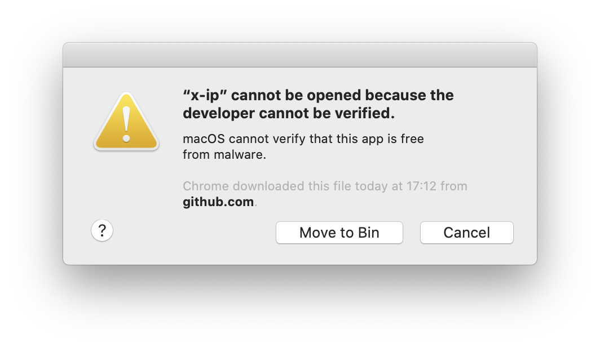
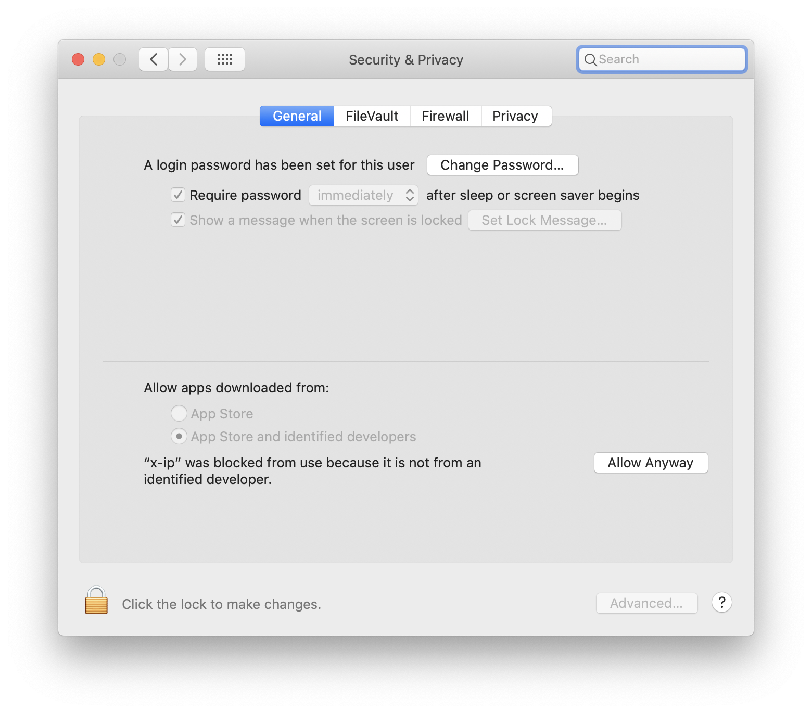
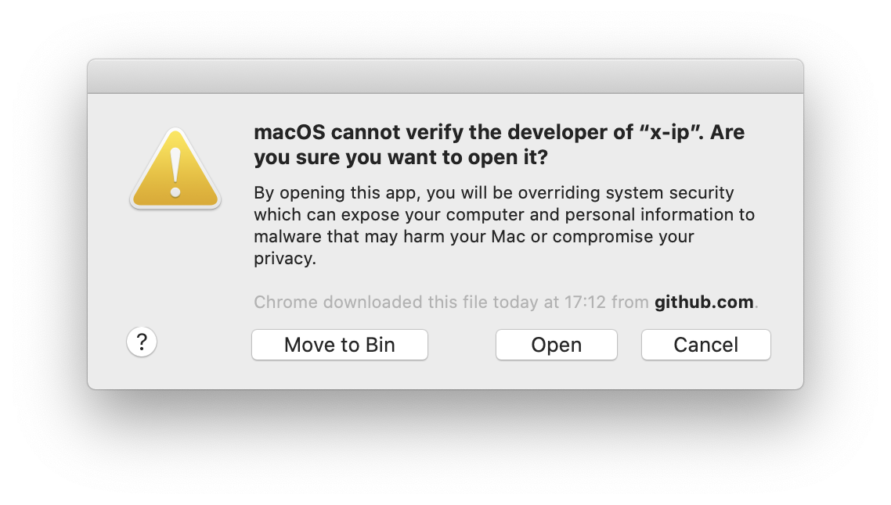

# XIP CLI script


This is the main XIP CLI utilities script for several commands.

## Install

Installation can be done through the following steps for your environment:

MacOS:

```bash
wget -qO - https://raw.githubusercontent.com/xip-online-applications/xip-cli/master/install/macos.sh | bash
```

Linux (x64):

```bash
wget -qO - https://raw.githubusercontent.com/xip-online-applications/xip-cli/master/install/linux.sh | bash
```

## To run on a Mac

You may receive security notices when you try to run the executable. This is due
to the fact we don't sign the executable (yet). The message looks like this:



To fix this, click on "Cancel" and then navigate to your security settings 
(system settings --> security). The following screenshot shows the screen:



Click on "Allow Anyway" to allow the `x-ip` tool to work. After that, execute
`x-ip` again. You will see this message this time:



Click on "Open" to allow the execution!
